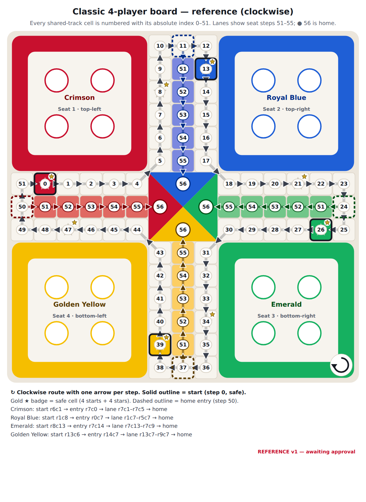
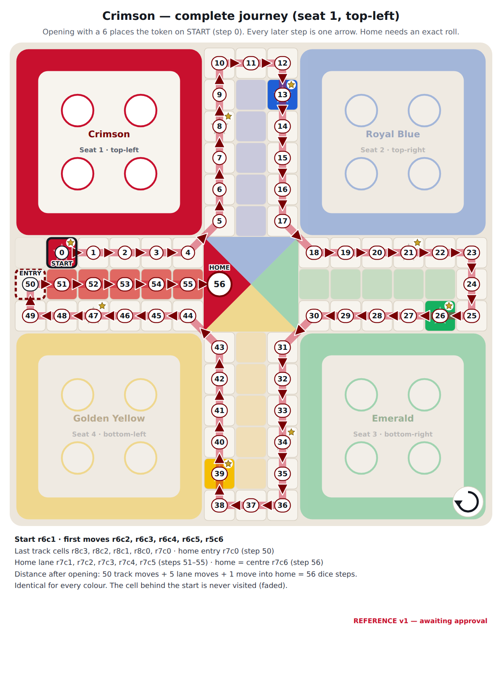
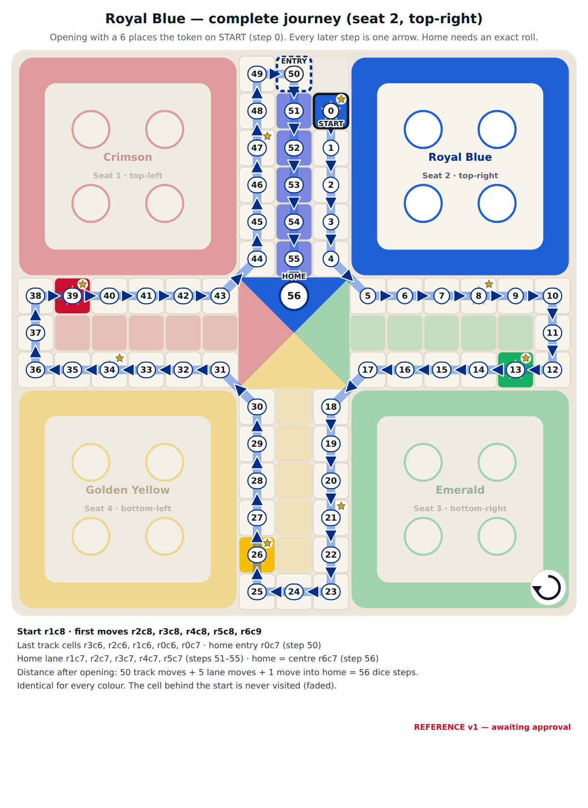
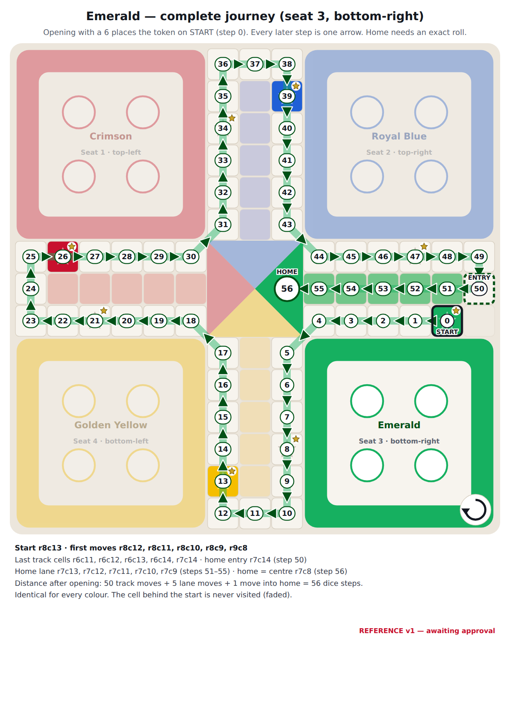
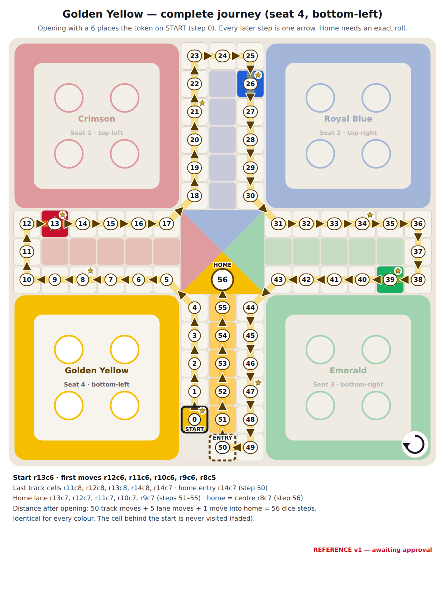

# Classic square board (4 players): visual specification

**Status: reference v1, awaiting your approval.** Once approved, this geometry is frozen: the rules engine (Phase 1) and both renderers must follow it, and any change needs a new approval.

## Geometry (source: `packages/board-layouts/src/classicSquareLayout.ts`)

- 15 × 15 grid; row 0 at the top. Cells are named `r<row>c<col>`.
- Bases in the four 6 × 6 corners: **seat 1 top-left, seat 2 top-right, seat 3 bottom-right, seat 4 bottom-left**, in clockwise turn order.
- Shared track: 52 cells, travelled **clockwise**. Each arm's two outer lines are track; the middle line is the owner's private home lane.
- Inner corners are crossed diagonally (for example r6c5 → r5c6), the standard Ludo turn around the centre.

| | Seat 1 · Crimson | Seat 2 · Royal Blue | Seat 3 · Emerald | Seat 4 · Golden |
| --- | --- | --- | --- | --- |
| Start cell (step 0, safe) | r6c1 (abs 0) | r1c8 (abs 13) | r8c13 (abs 26) | r13c6 (abs 39) |
| Star cell (start + 8, safe) | r2c6 (abs 8) | r6c12 (abs 21) | r12c8 (abs 34) | r8c2 (abs 47) |
| Turn-in cell (step 50) | r7c0 | r0c7 | r7c14 | r14c7 |
| Home lane (steps 51–55) | r7c1 → r7c5 | r1c7 → r5c7 | r7c13 → r7c9 | r13c7 → r9c7 |
| Finish (step 56) | centre, left triangle | centre, top triangle | centre, right triangle | centre, bottom triangle |

Each seat travels 51 track cells (steps 0–50, never the cell just behind its own start), 5 lane cells, then the finish. That's 56 moves from start to finish, identical for every seat.

## Step 56 versus the old position 58

The previous implementation (preserved on `backup/old-ludo-at-reset`) used **positions 0–51 on the track, a 6-cell home column 52–57, and "home" at 58**. Measured against the physical board, that model has two extra steps, and neither exists on a real board:

| | Old model (finish 58) | Reference (finish 56) |
| --- | --- | --- |
| Shared track | 52 steps (0–51): a **full** lap, including the cell directly behind the seat's own start | 51 steps (0–50): the seat turns in at its arm tip and never visits the cell behind its start |
| Seat 1 turn-in | passed r7c0 at 50, went **up** to r6c0 at 51, then **diagonally back** to r7c1: a detour past its own lane mouth | r7c0 (step 50) → r7c1 (step 51): a straight step into the lane |
| Home lane | 6 cells; the 6th (r7c6 for seat 1) lies **inside the 3×3 centre square** | 5 cells (r7c1–r7c5), exactly the 5 coloured cells printed on each arm |
| Finish | 58, a separate "home" after the centre cell | 56, the seat's centre triangle |
| Moves from start to finish | 58 | **56** |

The final pushed version of the old code (counter-clockwise) had the same 58 count, with a different inconsistency: seat 1's step 51 was r6c2, followed by a diagonal jump to r7c1.

## Indexing model (chosen and applied everywhere)

**One model:** a token is either in **base**, or at **step 0–56**. Step 0 is its start cell, steps 0–50 are the shared track, 51–55 are its private home lane, and **56 is home** (its centre triangle). The rules engine, both renderers and every test use this model through `@ludo/board-layouts/topology` (`CLASSIC_TOPOLOGY.finishStep = 56`).

| Question | Answer |
| --- | --- |
| Does leaving base count as a movement step? | **No.** Opening is a move that uses the 6, but it only *places* the token on its start cell (step 0); it covers no distance. The 6 is consumed by opening, and the bonus roll for the 6 still applies. |
| Shared-track positions visited | **51**: the start cell plus 50 further cells (steps 0–50). The one track cell a token never visits is the cell directly behind its own start (r6c0 for Crimson), because the token turns into its lane at the arm tip just before reaching it. |
| Private home-lane positions | **5** (steps 51–55): the five coloured cells printed on each arm. |
| Does the centre count as a position? | **Yes, one.** Moving from the last lane cell into the centre is one step, and it lands exactly on 56. |
| Dice steps from start to finish | **56** = 50 track moves + 5 lane moves + 1 move into home. The rolls after opening must total exactly 56; a roll that would pass 56 is not a legal move for that token. |
| Positions a token occupies, counting its start | 57 (0…56). Sources that say "57 squares" count positions; this model counts moves. Both describe the same physical path. |

**Why 56 and not 58.** A finish at 58 needs two positions that don't exist on a traditional board:

1. A 52nd track step onto the cell behind the token's own start. That forces a detour (up to r6c0, then diagonally back to r7c1) past the lane mouth at r7c0.
2. A 6th lane cell inside the 3 × 3 centre square, which on a printed board is the home triangle.

The old engine's 58 came from counting both. The new convention isn't chosen to match or avoid old tests; it is the count of moves along the printed board, and the reviewed-coordinate tests pin it cell by cell.

## Diagrams for approval

PNG previews (for review) are rendered from the SVG sources (scalable, committed) with `npm run design:png`.

### 1 · Complete board overview

Every shared-track cell carries its absolute number 0–51, with a bold arrow on each of the 52 clockwise steps. Coloured cells with a solid outline are the starts; gold ★ badges mark the 8 safe cells; dashed outlines are each colour's home entry; lanes are numbered 51–55, and ● 56 is home. SVG: [classic-board-overview.svg](generated/classic-board-overview.svg).

### 2 · Crimson journey

### 3 · Royal Blue journey

### 4 · Emerald journey

### 5 · Golden Yellow journey

SVG sources: [crimson](generated/classic-path-seat1-crimson.svg) · [royal blue](generated/classic-path-seat2-royal-blue.svg) · [emerald](generated/classic-path-seat3-emerald.svg) · [golden](generated/classic-path-seat4-golden.svg). The full step → cell table for all four colours is in [classic-reference.md](generated/classic-reference.md).

### Reviewed movement coordinates

| | Crimson | Royal Blue | Emerald | Golden Yellow |
| --- | --- | --- | --- | --- |
| Start (step 0) | r6c1 | r1c8 | r8c13 | r13c6 |
| Steps 1–5 | r6c2, r6c3, r6c4, r6c5, r5c6 | r2c8, r3c8, r4c8, r5c8, r6c9 | r8c12, r8c11, r8c10, r8c9, r9c8 | r12c6, r11c6, r10c6, r9c6, r8c5 |
| Corner cells (steps 4, 10, 12, 17, 23, 25, 30, 36, 38, 43, 49) | r6c5, r0c6, r0c8, r5c8, r6c14, r8c14, r8c9, r14c8, r14c6, r9c6, r8c0 | r5c8, r6c14, r8c14, r8c9, r14c8, r14c6, r9c6, r8c0, r6c0, r6c5, r0c6 | r8c9, r14c8, r14c6, r9c6, r8c0, r6c0, r6c5, r0c6, r0c8, r5c8, r6c14 | r9c6, r8c0, r6c0, r6c5, r0c6, r0c8, r5c8, r6c14, r8c14, r8c9, r14c8 |
| Steps 46–50 | r8c3, r8c2, r8c1, r8c0, **r7c0** | r3c6, r2c6, r1c6, r0c6, **r0c7** | r6c11, r6c12, r6c13, r6c14, **r7c14** | r11c8, r12c8, r13c8, r14c8, **r14c7** |
| Home lane (51–55) | r7c1 → r7c5 | r1c7 → r5c7 | r7c13 → r7c9 | r13c7 → r9c7 |
| Home (56) | r7c6 (left triangle) | r6c7 (top) | r7c8 (right) | r8c7 (bottom) |
| Never visited | r6c0 | r0c8 | r8c14 | r14c6 |
| Safe cells passed (steps 0, 8, 13, 21, 26, 34, 39, 47) | r6c1, r2c6, r1c8, r6c12, r8c13, r12c8, r13c6, r8c2 | r1c8, r6c12, r8c13, r12c8, r13c6, r8c2, r6c1, r2c6 | r8c13, r12c8, r13c6, r8c2, r6c1, r2c6, r1c8, r6c12 | r13c6, r8c2, r6c1, r2c6, r1c8, r6c12, r8c13, r12c8 |

The diagonal corner crossings are steps 4→5, 17→18, 30→31 and 43→44 for every colour. These are the traditional turns around the centre square, not shortcuts.

**Verified by tests:**

- `classicReviewedPaths.test.ts` (39 tests) pins every value in the table above as hand-written literals. It also checks equal distance (56), adjacency on every step, exactly those four diagonals, no repeated cell, never visiting the cell behind the start, and never entering an opponent's lane. Reintroducing the old 58-model detour fails 10 of them.
- `classicSquareLayout.test.ts` checks clockwise orientation (signed area) and 90° rotational symmetry between seats.

**Verified visually:** the overview and all four journey PNGs were rendered in Chromium and inspected step by step against the table above.

### Approval checklist

- [ ] Diagram 1: board overview (every cell, clockwise arrows, starts, safe cells, entries, lanes, home)
- [ ] Diagrams 2–5: the four complete journeys
- [ ] Seat placement: Crimson top-left, Royal Blue top-right, Emerald bottom-right, Golden Yellow bottom-left; clockwise turn order
- [ ] Reviewed coordinates table (starts, first moves, corners, last moves, entries, lanes, home, safe cells)
- [ ] Indexing model: base, then steps 0–56; opening places the token on step 0; 56 dice steps to home with an exact roll (replacing the old 58)
- [ ] Visual direction of the [concept](generated/classic-board-concept.svg) ([PNG](generated/png/classic-board-concept.png))
- [x] 2-player games: rectangle by default; the square with diagonally opposite seats (1 and 3) as an option (approved provisionally)

## Visual specification

| Element | 2D | 3D |
| --- | --- | --- |
| Board frame | white, 30 px radius, faint 6% shadow; page backdrop `#F3F0EA` | 0.25-cell-thick satin slab, 0.15 bevel |
| Track cell | porcelain `#F7F4EE`, 1 px `#ECE7DE` separator, radius 3 px | flush tiles, 0.01-unit groove between cells |
| Start cell | seat body colour + white clockwise chevron (coloured start cells are safe by convention; the chevron replaces the star) | seat colour satin tile, chevron engraved |
| Star cell | cell colour + `#8E8676` star at 40% | star engraved 0.01 deep |
| Home lane | 5-step tint ramp, pastel at the arm tip → saturated at the centre | same, satin |
| Base | five stepped tonal squares from the seat colour toward white (8% → 80%), 4 soft slot discs | inset tray with stepped tonal terraces and 4 shallow cups |
| Centre | 4 flat triangles in seat body colours | shallow pyramid (height 0.3), satin |
| Direction cue | white chevron on each start cell pointing clockwise; a tinted chevron on each turn-in cell pointing into the lane | engraved chevrons |
| Current player | base panel glows (outer ring in seat colour, pulsing 1.6 s) | base tray emissive lift 8% |

**Board numbers are never shown in play.** Numbering exists only in these review diagrams and in a debug overlay behind a developer flag.
